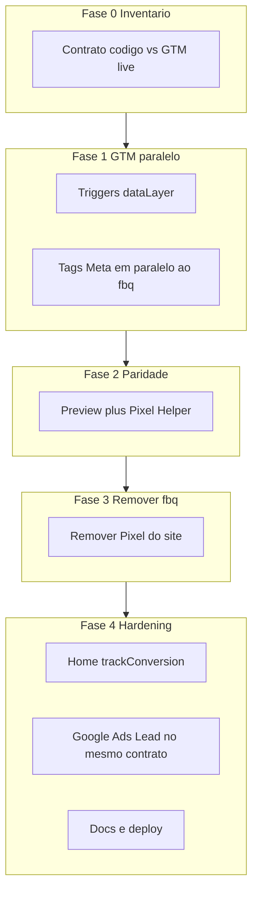

# Centralizar Meta no GTM — plano por fases

## Critério de coerência (regra-mãe)

O GTM só pode assumir a Meta se o resultado for **equivalente ao contrato atual do código**, não ao setup legado do container (formSubmission / Forminator).

| Ação no site (contrato atual)                                    | Evento dataLayer (já existe)                                                      | Evento Meta esperado        | Quem dispara Meta                             |
| ---------------------------------------------------------------- | --------------------------------------------------------------------------------- | --------------------------- | --------------------------------------------- |
| Load da página                                                   | GTM `gtm.js` + opcional `page_view`                                               | `PageView`                  | GTM                                           |
| Navegação SPA                                                    | `page_view` ([`trackPageView`](lib/analytics.ts) em [`_app.tsx`](pages/_app.tsx)) | `PageView`                  | GTM                                           |
| Contato / LP com `trackConversion(contact_form_submit)`          | `conversion_contact_form_submit`                                                  | `Lead`                      | GTM                                           |
| WhatsApp lead qualificado                                        | `conversion_whatsapp_lead_submitted`                                              | `Lead`                      | GTM                                           |
| `appointment_scheduled`                                          | `conversion_appointment_scheduled`                                                | `Schedule`                  | GTM (tag pronta; call site ainda inexistente) |
| Clique WhatsApp / telefone                                       | `google_ads_conversion` (`whatsapp`/`phone`)                                      | **Nenhum** Meta (só Google) | Sem tag Meta                                  |
| `free_evaluation_requested` / micro-ações (`button_click`, etc.) | dataLayer only                                                                    | **Nenhum** Meta             | Sem tag Meta                                  |

**Não é coerente** mapear Meta Lead em `gtm.formSubmission`, Forminator/`ajaxComplete` ou clique genérico — isso diverge do código e quebra WhatsApp lead / forms React com `preventDefault`.

**Duplicata proibida no estado final:** mesmo Pixel `856128025882243` não pode existir no código (`fbq`) e no GTM ao mesmo tempo.

Cada fase tem **gate**: só avança se o checklist da fase estiver verde.

---

## Anexos

| Fase | Fascículo                                                                                                                                                    |
| ---- | ------------------------------------------------------------------------------------------------------------------------------------------------------------ |
| 0    | [fase-0-inventario-baseline.md](fase-0-inventario-baseline.md) — inventário GTM live v24, call sites Meta, divergências, gap home, checklist Pixel Helper    |
| 1    | [fase-1-gtm-paralelo.md](fase-1-gtm-paralelo.md) — triggers CE 40–43, tags 38/39/44, versão publicada **25**                                                 |
| 2    | [fase-2-paridade.md](fase-2-paridade.md) — roteiro 1–7, Gate 2 verde (26 ago 2026); evidência [fase-2-parity-results.json](fase-2-parity-results.json)       |
| 3    | [fase-3-cutover.md](fase-3-cutover.md) — cutover sem `fbq`; Gate 3 verde (26 ago 2026); evidência [fase-3-cutover-results.json](fase-3-cutover-results.json) |
| 4    | [fase-4-hardening.md](fase-4-hardening.md) — home Lead + Ads Lead CE 46; GTM **v26**; Gate 4 verde; evidência [fase-4-hardening-results.json](fase-4-hardening-results.json) |

---

## Fase 0 — Inventário e baseline (somente leitura / documentação) — **completa**

**Objetivo:** congelar o “antes” para comparar o “depois”.

**Detalhe:** fascículo [fase-0-inventario-baseline.md](fase-0-inventario-baseline.md).

**Achados principais:**

- Load PageView: **duplicata** esperada (código `fbq` + tag 38 All Pages) no Pixel `856128025882243`.
- Lead GTM live (tag 39) ainda dispara em trigger **33** `formSubmission` — desalinhado do contrato (`conversion_*` / forms React com `preventDefault`).
- SPA `page_view`: tag 38 (`oncePerLoad`) não cobre; hoje só `fbq` em [`_app.tsx`](pages/_app.tsx).
- Home ([`index.tsx`](pages/index.tsx)) sem `trackConversion` — gap para Fase 4.
- Checklist Pixel Helper no fascículo: preencher antes de iniciar a Fase 1.

**Gate 0:** inventário GTM + código documentados; tabela contrato aceita; Pixel Helper anotado no fascículo.

**Não fazer nesta fase:** alterar GTM nem código.

---

## Fase 1 — GTM em paralelo (sem desligar o Pixel do site) — **completa**

**Objetivo:** GTM passa a disparar Meta pelos **mesmos** eventos dataLayer do contrato, **ainda com** `fbq` no site (duplicata temporária e consciente).

**Detalhe:** fascículo [fase-1-gtm-paralelo.md](fase-1-gtm-paralelo.md).

**Resultado (v25 live):**

- Triggers CE: **40** `page_view`, **41** `conversion_contact_form_submit`, **42** `conversion_whatsapp_lead_submitted`, **43** `conversion_appointment_scheduled`
- Tag **38** PageView: All Pages + 40, `oncePerEvent`
- Tag **39** Lead: 41 + 42 (sem formSubmission 33), `oncePerEvent`
- Tag **44** Schedule: 43, ativa
- Tag 35 Ads Lead / código `fbq`: inalterados

**Gate 1:** Custom Events do contrato disparam Meta no GTM; formSubmission **não** é mais o caminho do Meta Lead. Smoke Preview formal = Fase 2.

**Não fazer:** remover `NEXT_PUBLIC_META_PIXEL_ID` / `fbq` ainda.

---

## Fase 2 — Paridade funcional (validação dedicada) — **completa**

**Objetivo:** provar que GTM cobre **todos** os pontos que o código já cobre, antes de cortar `fbq`.

**Detalhe:** fascículo [fase-2-paridade.md](fase-2-paridade.md). Evidência: [fase-2-parity-results.json](fase-2-parity-results.json).

**Resultado (26 ago 2026, live v25):**

| #   | Ação                                | dataLayer esperado                         | Meta via GTM esperado | OK  |
| --- | ----------------------------------- | ------------------------------------------ | --------------------- | --- |
| 1   | Abrir home                          | `gtm.js`                                   | PageView (tag 38)     | Sim |
| 2   | Navegar SPA p/ `/contato`           | `page_view`                                | PageView (tag 38)     | Sim |
| 3   | Enviar form contato                 | `conversion_contact_form_submit`           | Lead (tag 39)         | Sim |
| 4   | LP americana submit                 | idem                                       | Lead                  | Sim |
| 5   | WhatsAppLeadButton (modal + submit) | `conversion_whatsapp_lead_submitted`       | Lead                  | Sim |
| 6   | Clique WhatsApp sem lead form       | gate / `button_click` (sem `conversion_*`) | **0** Lead Meta       | Sim |
| 7   | Clique telefone                     | `google_ads_conversion` phone              | **0** Lead Meta       | Sim |

Método: Playwright em produção; Leads 3–5 via `dataLayer.push` (isola GTM — `fbq('trackSingle', …)` Stape); casos 2/6/7 via UI. `gtm.formSubmission` → 0 Lead. Schedule opcional (tag 44) ok.

Nesta fase, Pixel Helper ainda pode mostrar **2×** PageView/Lead (código + GTM) — esperado. **GTM sozinho** confirma nos casos 1–5.

**Gate 2:** checklist 1–7 verde; gaps (home sem Lead, Schedule sem call site) anotados para Fase 4 / fora de escopo.

**Não avançar para Fase 3** se WhatsApp lead ou SPA PageView falharem no GTM.

---

## Fase 3 — Cortar Pixel do código (cutover) — **completa**

**Objetivo:** uma única origem Meta = GTM.

**Detalhe:** fascículo [fase-3-cutover.md](fase-3-cutover.md). Evidência: [fase-3-cutover-results.json](fase-3-cutover-results.json).

**Resultado (26 ago 2026, deploy `b1cb187`, GTM v25):**

- Removidos bloco Meta / `fbq` de [`DeferredMarketingScripts.tsx`](components/Analytics/DeferredMarketingScripts.tsx), [`_app.tsx`](pages/_app.tsx), [`ad-platform-tracking.ts`](lib/ad-platform-tracking.ts).
- `NEXT_PUBLIC_META_PIXEL_ID` removido do deploy obrigatório ([`deploy.yml`](.github/workflows/deploy.yml), docs).
- Gate 3: HTML Next sem Pixel; **1** PageView no load; **1** Lead por conversão (GTM); cliques sem Lead.

**Gate 3:** **VERDE** — 1 origem GTM; Network `fbevents` só via GTM.

**Handoff → Fase 4:** home `trackConversion`; tag 35 Ads Lead; docs ops.

---

## Fase 4 — Hardening e alinhamento residual — **completa**

**Objetivo:** fechar inconsistências do funil e Google Ads no **mesmo** critério de coerência.

**Detalhe:** fascículo [fase-4-hardening.md](fase-4-hardening.md). Evidência: [fase-4-hardening-results.json](fase-4-hardening-results.json).

**Resultado (26 ago 2026, deploy `829dc60`, GTM v26):**

- Home: `trackConversion(CONTACT_FORM_SUBMIT)` em [`index.tsx`](pages/index.tsx).
- GTM: DLV **45** `conversion_type`; CE **46** `google_ads_conversion` + `contact`; tag **35** Ads Lead em 46 (`oncePerEvent`, sem 33).
- Docs: README Analytics + guia de integração com tabela contrato para o Pagan.
- Gate 4: home UI → Meta Lead + Ads Lead; regressão contato/LP/WA; 0 Lead em cliques / formSubmission / type whatsapp.

**Gate 4:** **VERDE** — plano-matriz 0–4 completo.

---

## O que fica de fora (até demanda explícita)

- Implementar call site de `appointment_scheduled` no produto (tag Schedule no GTM já fica preparada na Fase 1).
- Meta CAPI server-side.
- Refatorar todos os `button_click` do site (micro-conversões GA4) — fora do escopo Meta Ads.

---

## Papéis sugeridos por fase

| Fase | Quem executa                                 | Atenção                      |
| ---- | -------------------------------------------- | ---------------------------- |
| 0    | Eng + Pagan                                  | Concordar na tabela contrato |
| 1–2  | Eng (MCP GTM) + Pagan (Preview/Pixel Helper) | Não cortar código ainda      |
| 3    | Eng (código + deploy)                        | Só após Gate 2               |
| 4    | Eng                                          | Home + Ads + docs            |

---

## Resumo do critério usado

1. **Fonte da verdade = código atual** (`trackCrossPlatformConversion` + `page_view`), não o GTM legado.
2. **GTM escuta dataLayer estável** (`conversion_*`, `page_view`), não DOM/form nativo.
3. **Mesmos eventos Meta** (`PageView`, `Lead`, `Schedule`); cliques WhatsApp/telefone **continuam sem Meta**.
4. **Fases com overlap consciente** (GTM paralelo → validar → remover `fbq`) para não ficar cego sem tracking.
5. **Gates bloqueantes** entre fases para execução cuidadosa.
